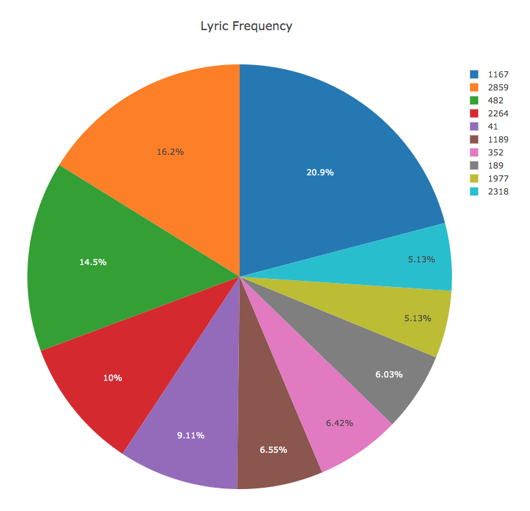
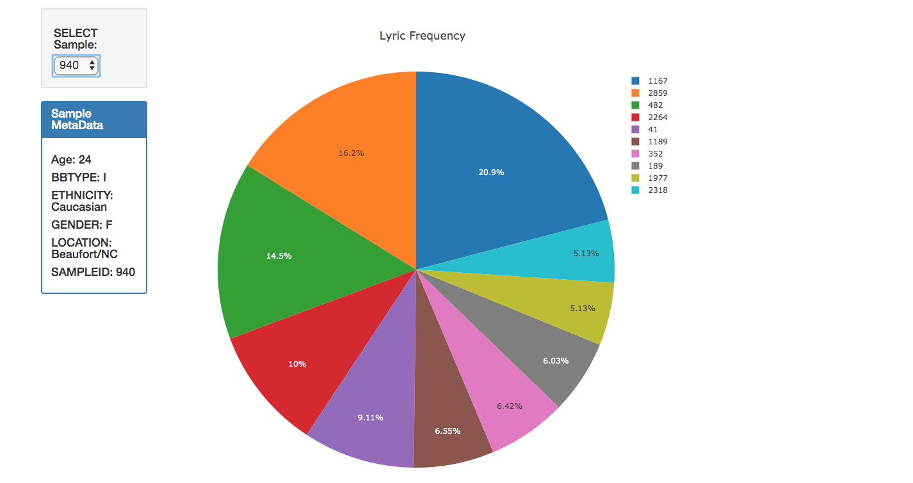
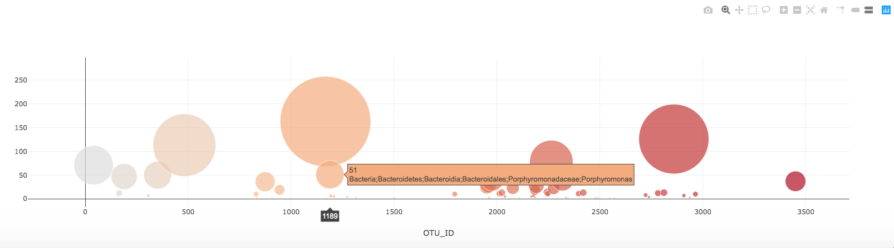

# Belly Button Biodiversity

We built an interactive dashboard to explore the [Belly Button Biodiversity DataSet](http://robdunnlab.com/projects/belly-button-biodiversity/).
## Heroku Link for the Project:
https://plotlyheroku.herokuapp.com

## Step 1 - Plotly.js

Use Plotly.js to build interactive charts for your dashboard.

* Create a PIE chart that uses data from your samples route (`/samples/<sample>`) to display the top 10 samples.

  * Use `sample_values` as the values for the PIE chart

  * Use `otu_ids` as the labels for the pie chart

  * Use `otu_labels` as the hovertext for the chart

  

* Create a Bubble Chart that uses data from your samples route (`/samples/<sample>`) to display each sample.

  * Use `otu_ids` for the x values

  * Use `sample_values` for the y values

  * Use `sample_values` for the marker size

  * Use `otu_ids` for the marker colors

  * Use `otu_labels` for the text values

  

* Display the sample metadata from the route `/metadata/<sample>`

  * Display each key/value pair from the metadata JSON object somewhere on the page

* Update all of the plots any time that a new sample is selected.

* You are welcome to create any layout that you would like for your dashboard. An example dashboard page might look something like the following.

